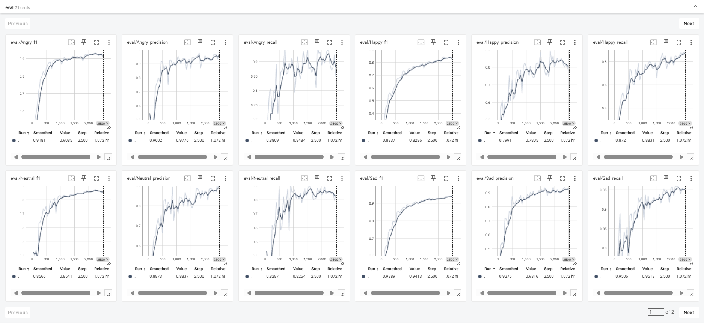
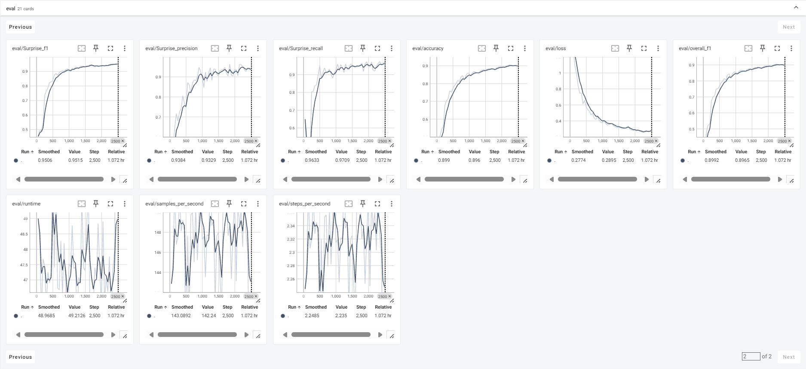

# VoiceEmotion
## 概述
- 本项目基于脸书训练的基线模型[facebook/wav2vec2-base](https://huggingface.co/facebook/wav2vec2-base)进行微调
- 微调后的模型主要解决1-5s的中文语音情感识别任务
- 摒弃ASR模块，直接让模型学习音频特征，这可能会造成性能上的缺失，但这只是初代版本，后续我会在架构和多模态上对此进行优化

## 改进点
- 预训练模型使用平均池化提取语音在每一帧的特征，这适用于大规模预训练，但可能无法适应下游任务
- 本项目采取注意力池化，新增一个注意力模块学习每个语音切片的权重，加权求和进行整条语音的特征归一（有点过于简单了，后续会考虑改进）
- 数据集参差不齐，为了强化模型在短音频上的泛化能力，本项目对小于2s的语音进行数据增强
  - 对音速进行随机的增减
  - 对音高进行随机的增减

## 不足
- 模型架构并没有很大的创新
- 模型对于长音频泛化能力不强
- 缺乏对数据集的增强，如加噪等
- 训练过程中出现梯度爆炸，加入梯度裁剪和归一化后有所缓和。还未找出原因，后续会改进

## 最佳结果

|   指标   | 值     |
|:------:|-------|
|  评估损失  | 0.29  |
| 整体准确率  | 89.6% |
| 整体F1分数 | 89.6% |

|  情感类别   | 精确率   | 召回率   | F1分数   |
|:-------:|-------|-------|-------|
|  Angry  | 97.8% | 84.8% | 90.8% |
|  Happy  | 78.0% | 88.3% | 82.9% |
|   Sad   | 93.2% | 95.1% | 94.1% |
| Suprise | 93.3% | 97.1% | 95.1% |
| Netural | 88.4% | 82.6% | 85.4% |

## 总结
- 可以看见Happy识别的精确率并不高，需要改进
- 这是我独立finetune的第一个模型，如果有哪里做的不对请大家多多包涵，希望大家多多给予我建议
- 需要数据集的话可以发邮箱到2396768163@qq.com